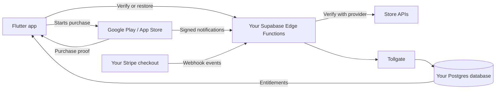

# Tollgate

**One purchase API for Google Play, Apple's App Store, and Stripe — backed by
your own Supabase project.**

[](https://github.com/VDiPaola/Tollgate/actions/workflows/ci.yml)
[](LICENSE)
[](https://github.com/VDiPaola/Tollgate/tree/v0.1.3)

[Get started](docs/host-integration.md) ·
[Browse the docs](docs/README.md) ·
[Flutter client](packages/flutter/README.md) ·
[Supabase package](packages/supabase/README.md)

> [!IMPORTANT]
> Tollgate is pre-release software. Google Play has been tested end to end on
> real hardware; the Stripe and Apple integrations have automated coverage but
> have not yet processed live purchases. See [project status](#project-status)
> before using Tollgate in production.

Tollgate is an open-source library, not a hosted billing service. It verifies
purchases, normalises subscription state, and stores entitlements in a
`tollgate` schema inside **your** Postgres database. There is no Tollgate account
to create and no third-party Tollgate server holding customer data.

## Why Tollgate?

A Flutter app that sells digital access on mobile and the web can end up with
three payment providers, three webhook formats, and three definitions of an
active subscription. Tollgate translates those store-specific events into one
entitlement model:

```sql
select tollgate.has_entitlement(auth.uid(), 'premium');
```

Your app asks a simple question — “does this user have premium?” — while
Tollgate handles verification, renewals, refunds, and missed-notification
recovery on the server.

### What you get

- **Server-side verification.** Client-provided purchase data never decides
  access by itself.
- **One entitlement model.** Google Play, the App Store, and Stripe resolve to
  the same Postgres records.
- **Reliable subscription updates.** Signed store notifications keep state
  current, while explicit refreshes repair missed events.
- **Exactly-once consumable delivery.** Your SQL hook grants coins, credits, or
  other consumables in the same transaction that records delivery.
- **Refund and chargeback handling.** Tollgate flags affected customers and
  lets your application choose its clawback policy.
- **Data ownership.** Purchases and entitlements remain in your Supabase
  project.

### What stays in your application

Tollgate deliberately does not provide a paywall editor, pricing dashboard,
checkout builder, tax engine, or A/B testing. It also never handles card
details. Your application still decides:

- what each product unlocks;
- how the paywall looks;
- how Stripe Checkout is created on the web; and
- what happens to a consumed item after a refund.

## How it works



All Tollgate runtime components in this diagram run inside your application or
your Supabase project. The only external systems are the payment providers you
already use.

## Is Tollgate a good fit?

| Use Tollgate when… | Consider another approach when… |
| --- | --- |
| You have a Flutter app and a Supabase backend. | You want a fully hosted purchase platform. |
| You sell subscriptions, consumables, or permanent unlocks. | You need a no-code paywall or experimentation dashboard. |
| You want the same entitlement checks across mobile and web. | You do not want to operate store credentials, webhooks, and database migrations. |
| You want purchase data to stay in your own database. | You need a production-proven Apple or Stripe integration today. |

## Quick start

> [!NOTE]
> This overview shows the shape of an installation. Follow the
> [host integration guide](docs/host-integration.md) for the complete,
> verifiable setup.

### Prerequisites

- A Supabase project and permission to run migrations and deploy Edge Functions
- A Flutter application for the mobile client
- Deno 2 for local TypeScript development
- Store accounts and products for each provider you enable
- A Mac with Xcode for building and testing the Apple client

### 1. Install the database schema

Copy the two migrations into your Supabase project, preserving their order:

```text
packages/supabase/migrations/0001_tollgate_schema.sql
packages/supabase/migrations/0002_tollgate_functions.sql
```

Then expose the `tollgate` schema through PostgREST. The
[`@tollgate/supabase` guide](packages/supabase/README.md) includes the config and
verification steps.

### 2. Describe what you sell

Create entitlement definitions, internal products, and mappings from each
store's product IDs. Consumables also point to SQL grant and revoke hooks owned
by your application.

### 3. Deploy the server handlers

Create one authenticated client function and a public notification function for
each enabled store. Pin remote imports to a release tag — currently `v0.1.3` —
instead of following `main`.

### 4. Add the Flutter client

```yaml
dependencies:
  tollgate:
    git:
      url: https://github.com/VDiPaola/Tollgate.git
      path: packages/flutter
      ref: v0.1.3
```

Implement `TollgateBackend` using your existing Supabase client, configure it at
app startup, and use the same API on Android and iOS:

```dart
await Tollgate.configure(backend: SupabaseTollgateBackend(supabase));

final products = await Tollgate.instance.products({'premium.monthly'});
final result = await Tollgate.instance.purchase(products.first);

if (Tollgate.instance.isActive('premium')) {
  // Show the paid experience.
}
```

The full implementation is in the [Flutter client guide](packages/flutter/README.md).

### 5. Connect and test each store

Configure only the providers your app uses:

- [Google Play setup](docs/google-setup.md)
- [Apple App Store setup](docs/apple-setup.md)
- [Stripe integration](docs/host-integration.md#5-stripe-if-the-app-also-sells-on-the-web)

Test alongside your current access logic before making Tollgate the source of
truth. A real in-app purchase still requires a person to complete the store
dialog on a physical device.

## Project status

Tollgate is currently at `v0.1.3`. APIs and migrations may change before a
stable release.

| Integration | Implemented | Automated tests | Live validation |
| --- | :---: | :---: | --- |
| Google Play / Play Billing 8 | ✅ | ✅ | ✅ Subscriptions, consumables, renewals, refunds, and RTDN on real hardware |
| Stripe | ✅ | ✅ | ⚠️ Not yet connected to a live Stripe account |
| Apple / StoreKit 2 | ✅ | ✅ | ⚠️ Not yet built or tested on a Mac or iOS device |

The Apple server tests include generated certificate chains and signed payloads
to exercise forged, expired, and altered data. That is useful security coverage,
but it is not a substitute for a real App Store sandbox purchase.

## Packages

| Package | Purpose |
| --- | --- |
| [`packages/core`](packages/core) | Runtime-neutral TypeScript orchestration, provider adapters, models, cryptography, and a fake store for tests |
| [`packages/supabase`](packages/supabase/README.md) | SQL migrations, Postgres persistence, and Supabase Edge Function handlers |
| [`packages/flutter`](packages/flutter/README.md) | Flutter client using Play Billing on Android and StoreKit 2 on Apple platforms |

The TypeScript core uses standard `fetch` and Web Crypto APIs without Node.js
built-ins, so it can run in Deno-based Supabase Edge Functions and compatible
Node.js runtimes.

> [!NOTE]
> There is no separate browser SDK. Flutter web exposes no in-app store, and a
> web application can call its own backend after creating a Stripe checkout.
> Tollgate verifies and records the resulting Stripe object; it does not create
> the checkout.

## Documentation

Start with the [documentation index](docs/README.md), or jump directly to a
task:

| Goal | Guide |
| --- | --- |
| Evaluate the architecture and terminology | [Documentation overview](docs/README.md) |
| Install Tollgate in an application | [Host integration](docs/host-integration.md) |
| Configure Google Play and RTDN | [Google Play setup](docs/google-setup.md) |
| Configure App Store Connect and notifications | [Apple App Store setup](docs/apple-setup.md) |
| Install the database package | [`@tollgate/supabase`](packages/supabase/README.md) |
| Integrate purchases in Flutter | [Flutter client](packages/flutter/README.md) |
| Configure environment variables | [`.env.example`](.env.example) |

## Development

Clone the repository, then run the checks relevant to your change:

```bash
deno task check          # Type-check TypeScript packages and scripts
deno task lint           # Lint TypeScript
deno task test           # Unit tests; OpenSSL is needed for the full suite
deno task test:db        # SQL tests in a temporary Docker container
deno task probe:google   # Validate Google credentials from .env
```

The Flutter package uses its own toolchain:

```bash
cd packages/flutter
flutter pub get
flutter analyze
flutter test
```

CI runs the TypeScript, SQL, and Flutter checks on every pull request. Database
tests use a disposable Postgres container and do not touch a Supabase project.
Certificate-chain tests are skipped locally when `openssl` is unavailable; CI
runs them with OpenSSL installed.

## Security and data ownership

- Store credentials and the Supabase service-role key belong only in your
  deployment's secret store. Use [`.env.example`](.env.example) as a template;
  never commit `.env`.
- Store notifications are authenticated by Google-signed identity tokens,
  Apple JWS certificate chains, or Stripe webhook signatures.
- Every Tollgate table has row-level security enabled. Privileged mutation
  functions are restricted to `service_role`; signed-in users can read only
  their own customer and entitlement data.
- `TOLLGATE_ENVIRONMENT` defaults to production so test purchases cannot grant
  production access unless a deployment explicitly opts into sandbox mode.

If you find a security issue, avoid including credentials, purchase tokens, or
customer data in a public report.

## License

Tollgate is available under the [MIT License](LICENSE).
