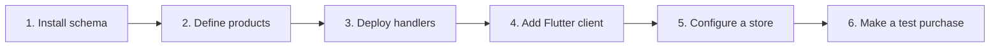

# Tollgate documentation

[← Back to the project overview](../README.md)

Use this page to find the shortest path from evaluating Tollgate to completing
a real test purchase.

> [!IMPORTANT]
> Tollgate is pre-release software. The Google Play path has been validated on
> real hardware. Stripe and Apple are implemented and covered by automated
> tests, but have not yet processed live purchases.

## Choose a guide

| I want to… | Start here |
| --- | --- |
| Understand what Tollgate does | [Project overview](../README.md#why-tollgate) |
| Install Tollgate in a Supabase and Flutter app | [Host integration](host-integration.md) |
| Configure the database package | [`@tollgate/supabase`](../packages/supabase/README.md) |
| Add purchasing to a Flutter app | [Flutter client](../packages/flutter/README.md) |
| Connect Google Play | [Google Play setup](google-setup.md) |
| Connect Apple's App Store | [Apple App Store setup](apple-setup.md) |
| Connect Stripe | [Stripe integration](host-integration.md#5-stripe-if-the-app-also-sells-on-the-web) |
| Find a credential or environment variable | [`.env.example`](../.env.example) |

## Recommended setup order

1. Follow the [host integration guide](host-integration.md) through the database,
   catalogue, and Edge Function steps.
2. Add the [Flutter client](../packages/flutter/README.md) and confirm the app can
   reach its authenticated client function.
3. Configure [Google Play](google-setup.md), [Apple](apple-setup.md), or Stripe.
   You only need the providers your application uses.
4. Run a real sandbox or licence-test purchase alongside your existing access
   logic before switching Tollgate into production.

## Key concepts

| Term | Meaning in Tollgate |
| --- | --- |
| **Entitlement** | A named capability such as `premium` that your app can check without knowing where it was purchased |
| **Product** | Your internal definition of something sold, such as `premium_monthly` or `gems_500` |
| **Store product** | A Google, Apple, or Stripe identifier mapped to one internal product |
| **Purchase** | A provider transaction normalised into Tollgate's common model |
| **Account token** | An opaque identifier that connects a store transaction to one of your users without exposing their user ID |
| **Grant hook** | Your SQL function that delivers a consumable exactly once |
| **Notification** | A signed webhook or Pub/Sub message telling Tollgate that provider state changed |

## Where things run

| Component | Location | Responsibility |
| --- | --- | --- |
| Flutter client | Your application | Starts purchases, forwards proof, and displays current access |
| Tollgate core | Your server runtime | Verifies and normalises provider data |
| Edge Function handlers | Your Supabase project | Expose authenticated app actions and store notification endpoints |
| SQL pack | Your Postgres database | Records purchases and computes entitlements |
| Grant and revoke hooks | Your database | Apply app-specific consumable behaviour |

Tollgate does not operate a hosted control plane or receive your customer data.

## Before production

- [ ] Pin both TypeScript and Flutter dependencies to the same release tag.
- [ ] Keep `TOLLGATE_ENVIRONMENT` unset or set to `production` in production.
- [ ] Store all provider credentials and the service-role key as deployment
      secrets.
- [ ] Send a signed test notification from every configured provider.
- [ ] Complete a purchase, renewal, cancellation, refund, and restore flow where
      the provider's test tools allow it.
- [ ] Run Tollgate alongside the current access system before making it the
      source of truth.

> [!TIP]
> When troubleshooting, work in the same order as the setup: schema access,
> product mapping, server verification, notification delivery, then the device
> client. Each layer depends on the one before it.
