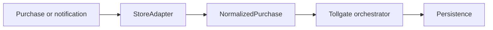

# @tollgate/core

[← Project overview](../../README.md) · [Documentation](../../docs/README.md)

The runtime-neutral TypeScript engine behind Tollgate. It verifies provider
data, coordinates purchase delivery, processes notifications, and exposes one
normalised purchase and entitlement model across Google Play, Apple's App Store,
and Stripe.

Most Supabase users should start with
[`@tollgate/supabase`](../supabase/README.md), which provides the database-backed
`Persistence` implementation and ready-made HTTP handlers.

> [!NOTE]
> This is a low-level package for server runtimes and custom integrations. It is
> not a browser checkout SDK and must not be used to trust purchase claims
> directly from a client.

## Design

`@tollgate/core` separates payment-provider behaviour from data storage:



- A `StoreAdapter` verifies and translates one provider's API and notifications.
- `Tollgate` owns ordering, idempotency, refresh, delivery, and revocation flow.
- A `Persistence` implementation owns transactions and entitlement storage.
- `SupabasePersistence` is provided by the sibling Supabase package.

The package uses standard `fetch` and Web Crypto APIs and has no Node.js
built-ins. It is designed for Deno-based Supabase Edge Functions and compatible
Node.js server runtimes.

## Included adapters

| Export | Provider |
| --- | --- |
| `GoogleAdapter` | Google Play Developer API and real-time developer notifications |
| `AppleAdapter` | App Store Server API and App Store Server Notifications V2 |
| `StripeAdapter` | Stripe subscriptions, payment intents, and webhooks |
| `FakeStore` | Deterministic purchase flows for application tests |

## Creating an instance

```ts
import { GoogleAdapter, Tollgate } from '@tollgate/core';
import { SupabasePersistence } from '@tollgate/supabase';
import { createClient } from '@supabase/supabase-js';

const serviceRoleClient = createClient(
  Deno.env.get('SUPABASE_URL')!,
  Deno.env.get('SUPABASE_SERVICE_ROLE_KEY')!,
);

const tollgate = new Tollgate({
  adapters: [
    new GoogleAdapter({
      packageName: Deno.env.get('GOOGLE_PLAY_PACKAGE_NAME')!,
      serviceAccount: Deno.env.get('GOOGLE_SERVICE_ACCOUNT_JSON_BASE64')!,
      pubsubAudience: Deno.env.get('GOOGLE_PUBSUB_AUDIENCE'),
      pubsubServiceAccountEmail: Deno.env.get(
        'GOOGLE_PUBSUB_SERVICE_ACCOUNT_EMAIL',
      ),
    }),
  ],
  persistence: new SupabasePersistence({ client: serviceRoleClient }),
  environment: Deno.env.get('TOLLGATE_ENVIRONMENT') === 'sandbox'
    ? 'sandbox'
    : 'production',
});
```

Only configure adapters with complete credentials. An omitted adapter produces
a clear “unknown store” response; a partially configured adapter tends to fail
inside a purchase flow.

## Main API

| Method | Purpose |
| --- | --- |
| `customer(userId)` | Get the opaque account token clients attach to purchases |
| `storeProducts(store)` | List the configured products for one provider |
| `purchase(store, request)` | Verify, record, grant, and finish a purchase in the safe order |
| `entitlements(userId)` | Read the user's current normalised entitlements |
| `refresh(userId)` | Re-read known purchases from their providers |
| `handleNotification(store, request)` | Verify and apply a provider notification |

See [`src/tollgate.ts`](src/tollgate.ts), [`src/adapter.ts`](src/adapter.ts), and
[`src/persistence.ts`](src/persistence.ts) for the complete typed contracts.

## Development

From the repository root:

```bash
deno task check
deno task lint
deno task test
```

The generated certificate-chain and signed-payload tests require `openssl`.
They are skipped locally when it is unavailable; CI runs the complete suite
with OpenSSL installed.
